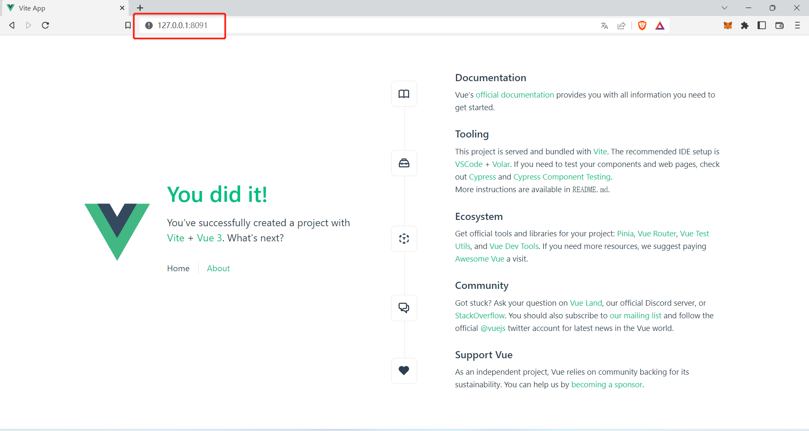

# Dockerfile最佳实践

## example1:Docker容器+虚拟屏幕Xfvb+远程桌面X11VNC+谷歌浏览器

### 使用场景
一般linux系统是没有图形化界面的，如果你的程序需要图形化桌面下运行（例如谷歌浏览器），你又不想安装一个xfce或者使用windows server的话。你可以给linux安装一个虚拟屏幕，安装虚拟屏幕xfvb。但是只安装虚拟屏幕是无法调试的，这时你可以给docker容器安装VNC，当你的浏览器自动化脚本程序发生异常时，这样你随时就可以远程到虚拟桌面去调试。

### 效果图
- 未启动浏览器时的虚拟桌面，屏幕黑漆漆的。


- 使用`google-chrome --no-sandbox`命令启动浏览器后，可以看到虚拟桌面上的浏览器。


## example2: 使用Docker部署Vue项目

## 使用步骤
当你想为vue项目制作docker镜像时，只需将example2目录下的Docker文件夹复制到你的vue项目中。复制后结构项目目录结构如下图所示。这里为了缩小文件夹体积，我只保留了vue项目build后的dist文件夹。


## 快捷指令

```
# 构建image镜像命令
#  -f：指定Dockerfile文件路径 -t：镜像命名 --no-cache：构建镜像时不使用缓存  
# docker image build -f ./Docker/Dockerfile   --progress plain -t my-vue:2.0 . 


#  --name 容器名 -p 80:8091 容器的80端口映射到宿主机器的8091端口   -t 镜像名  -i 交互式
# docker run --name myvue2   -p 8091:80 --restart=always -i -t my-vue:2.0
```
### 效果图
在浏览器中使用`宿主ip:8091`即可访问vue项目。这里我是在本地启动的容器，所以宿主机器ip为127.0.0.1
